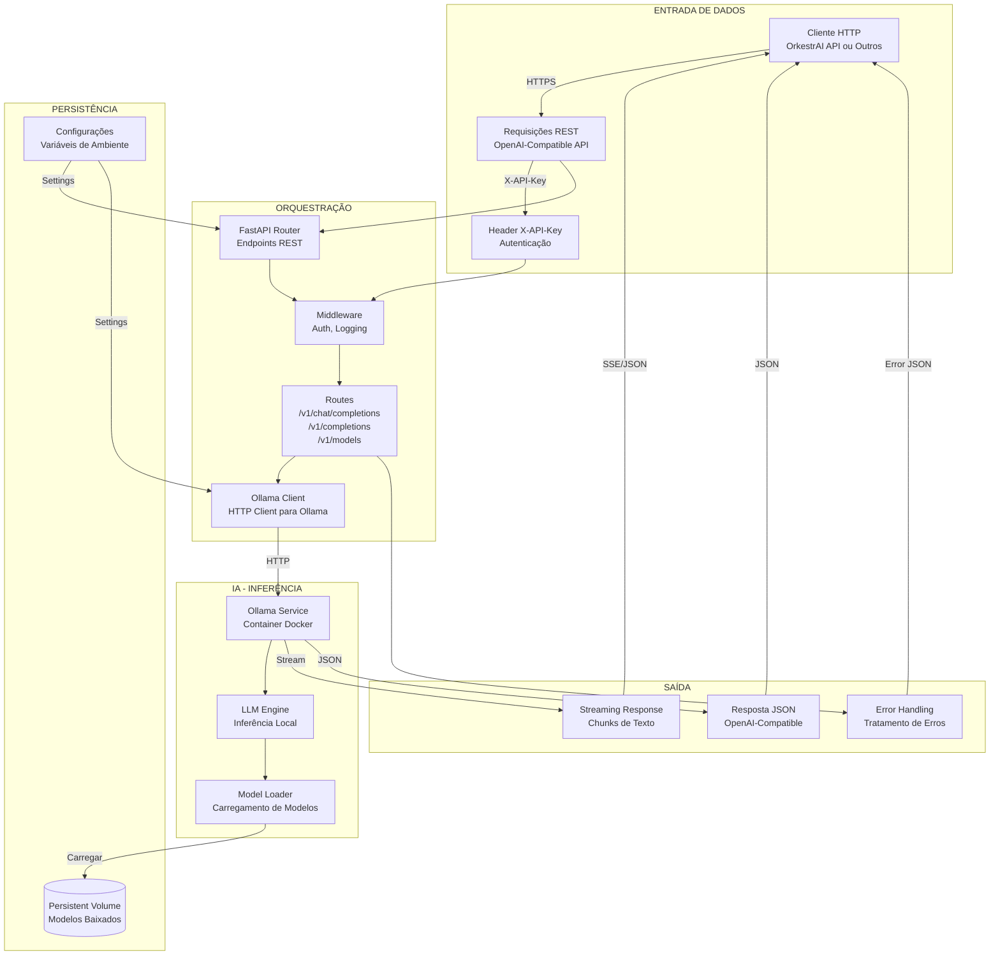

# Tensoria - Open Source LLM API Infrastructure

API de inferência de LLMs open source compatível com OpenAI, construída com FastAPI e Ollama. Fornece uma interface padronizada para executar modelos LLM open-source localmente ou em servidores dedicados.

## 🎯 O que é?

Tensoria é uma infraestrutura de API para modelos LLM open-source que:

- **API compatível com OpenAI** - Use os mesmos endpoints que OpenAI/Gemini
- **Múltiplos modelos suportados** - Mistral, DeepSeek, Qwen, Llama, e muitos outros
- **Execução local ou remota** - Rode modelos em sua própria infraestrutura
- **Docker-ready** - Setup completo com Docker Compose
- **Ollama-powered** - Usa Ollama como engine de inferência
- **Sem custos de API** - Execute modelos localmente sem depender de serviços externos pagos

### Casos de Uso

- Executar modelos LLM open-source sem custos de API
- Desenvolvimento e testes de aplicações com IA
- Infraestrutura privada para modelos de IA
- Integração com plataformas que precisam de API compatível com OpenAI

## 🏗️ Arquitetura

### Diagrama de Fluxo de Dados



### Decisões Arquiteturais Principais

#### 1. **API Compatível com OpenAI**
- **Decisão:** Implementação de endpoints compatíveis com OpenAI (`/v1/chat/completions`, `/v1/completions`)
- **Motivo:** Permite uso de qualquer cliente OpenAI existente sem modificações
- **Impacto:** Facilita integração e reduz fricção para desenvolvedores

#### 2. **Ollama como Engine de Inferência**
- **Decisão:** Ollama como serviço de inferência em vez de implementação própria
- **Motivo:** Ollama é maduro, suporta muitos modelos e gerencia eficientemente GPU/CPU
- **Impacto:** Foco no wrapper/API em vez de infraestrutura de inferência

#### 3. **Containerização com Docker Compose**
- **Decisão:** Separação em containers: API FastAPI + Ollama Service
- **Motivo:** Isolamento, escalabilidade independente e facilidade de deploy
- **Impacto:** Deploy simplificado e manutenção mais fácil

#### 4. **Persistent Volume para Modelos**
- **Decisão:** Volume Docker persistente para armazenar modelos baixados
- **Motivo:** Modelos não são perdidos ao reiniciar containers
- **Impacto:** Melhor experiência de uso e economia de banda

#### 5. **Autenticação via API Key**
- **Decisão:** Autenticação simples via header `X-API-Key`
- **Motivo:** Simplicidade e compatibilidade com padrões de API
- **Impacto:** Segurança adequada sem complexidade desnecessária

#### 6. **Streaming de Respostas**
- **Decisão:** Suporte a streaming de respostas (SSE ou JSON streaming)
- **Motivo:** Experiência de usuário melhor com feedback em tempo real
- **Impacto:** Reduz percepção de latência, especialmente para modelos maiores

#### 7. **Nginx como Reverse Proxy (Produção)**
- **Decisão:** Nginx na frente da API em produção com IP allowlist
- **Motivo:** Segurança adicional e controle de acesso
- **Impacto:** Camada extra de proteção para ambientes de produção

#### 8. **Modelos Não Baixados Automaticamente**
- **Decisão:** Modelos devem ser baixados manualmente via `ollama pull`
- **Motivo:** Controle sobre espaço em disco e escolha de modelos
- **Impacto:** Flexibilidade para o usuário escolher modelos adequados ao seu caso

#### 9. **Timeout e Keep-Alive Configuráveis**
- **Decisão:** Variáveis de ambiente para controlar timeouts e keep-alive
- **Motivo:** Flexibilidade para diferentes cenários (modelos rápidos vs lentos)
- **Impacto:** Melhor adaptação a diferentes modelos e hardware

#### 10. **Desabilitação de Docs em Produção**
- **Decisão:** Endpoints `/docs`, `/redoc` desabilitados quando `API_KEY` está configurada
- **Motivo:** Segurança - não expor documentação em produção
- **Impacto:** Redução de superfície de ataque

## 🚀 Quick Start

### Pré-requisitos

- **Docker** e **Docker Compose** instalados
- **Espaço em disco** suficiente (cada modelo pode ter de 2GB a 40GB+)

### Passo a Passo Completo

```bash
# 1. Clonar repositório
git clone https://github.com/seu-usuario/tensoria.git
cd tensoria

# 2. Subir os containers (Ollama + API)
docker compose up -d

# 3. Aguardar inicialização (alguns segundos)
sleep 10

# 4. Verificar se está rodando
curl http://localhost:8002/health
# Deve retornar: {"status": "ok"}

# 5. Baixar um modelo (veja seção abaixo para detalhes)
docker exec -it tensoria-ollama ollama pull mistral

# 6. Verificar modelos instalados
curl http://localhost:8002/v1/models
```

> ⚠️ **IMPORTANTE**: Nenhum modelo é baixado automaticamente!

### 2. Instalar modelos manualmente

⚠️ **IMPORTANTE**: Nenhum modelo é baixado automaticamente! Você precisa baixar manualmente os modelos que deseja usar.

#### Como baixar um modelo específico

```bash
# Formato básico
docker exec -it tensoria-ollama ollama pull <nome-do-modelo>

# Exemplos:

# Mistral (recomendado para começar - ~4GB)
docker exec -it tensoria-ollama ollama pull mistral

# Mistral com versão específica
docker exec -it tensoria-ollama ollama pull mistral:7b-instruct

# DeepSeek Coder (bom para código - ~4GB)
docker exec -it tensoria-ollama ollama pull deepseek-coder:6.7b

# DeepSeek Coder versão maior (melhor qualidade - ~20GB)
docker exec -it tensoria-ollama ollama pull deepseek-coder:33b

# Qwen (bom custo-benefício - ~4GB)
docker exec -it tensoria-ollama ollama pull qwen:7b

# Qwen versão mais recente
docker exec -it tensoria-ollama ollama pull qwen2:7b

# Llama 3 (Meta - ~4GB)
docker exec -it tensoria-ollama ollama pull llama3

# Llama 3 versão maior (8B - ~5GB)
docker exec -it tensoria-ollama ollama pull llama3:8b

# CodeLlama (especializado em código - ~4GB)
docker exec -it tensoria-ollama ollama pull codellama

# Phi-3 (Microsoft - pequeno e eficiente - ~2GB)
docker exec -it tensoria-ollama ollama pull phi3
```

#### Verificar modelos instalados

```bash
# Listar todos os modelos baixados
docker exec -it tensoria-ollama ollama list

# Exemplo de saída:
# NAME                    ID              SIZE    MODIFIED
# mistral:latest          abc123def456    4.1 GB  2 hours ago
# deepseek-coder:6.7b     def456ghi789    4.2 GB  1 hour ago
```

#### Remover um modelo

```bash
# Remover um modelo específico para liberar espaço
docker exec -it tensoria-ollama ollama rm mistral

# Verificar espaço liberado
docker exec -it tensoria-ollama ollama list
```

#### Baixar modelo com tag específica

Alguns modelos têm múltiplas versões/tags disponíveis:

```bash
# Ver todas as tags disponíveis de um modelo
docker exec -it tensoria-ollama ollama show mistral

# Baixar versão específica
docker exec -it tensoria-ollama ollama pull mistral:7b-instruct-q4_0
docker exec -it tensoria-ollama ollama pull mistral:7b-instruct-q8_0
```

#### Modelos recomendados por caso de uso

**Para começar (pequeno e rápido):**
```bash
docker exec -it tensoria-ollama ollama pull mistral          # ~4GB
docker exec -it tensoria-ollama ollama pull phi3            # ~2GB
```

**Para código:**
```bash
docker exec -it tensoria-ollama ollama pull deepseek-coder:6.7b  # ~4GB
docker exec -it tensoria-ollama ollama pull codellama            # ~4GB
```

**Para qualidade máxima:**
```bash
docker exec -it tensoria-ollama ollama pull deepseek-coder:33b   # ~20GB
docker exec -it tensoria-ollama ollama pull llama3:70b            # ~40GB
```

**Para multilíngue (português):**
```bash
docker exec -it tensoria-ollama ollama pull qwen:7b              # ~4GB
docker exec -it tensoria-ollama ollama pull qwen2:7b             # ~4GB
```

### 3. Verificar status

```bash
# Health check
curl http://localhost:8002/health

# Listar modelos instalados
curl http://localhost:8002/v1/models
```

## 📡 Endpoints da API

### Chat Completions (OpenAI-compatible)

```bash
curl -X POST http://localhost:8002/v1/chat/completions \
  -H "Content-Type: application/json" \
  -d '{
    "model": "mistral",
    "messages": [
      {"role": "user", "content": "Olá, como vai?"}
    ],
    "temperature": 0.7
  }'
```

### Text Completions (Legacy)

```bash
curl -X POST http://localhost:8002/v1/completions \
  -H "Content-Type: application/json" \
  -d '{
    "model": "mistral",
    "prompt": "O céu é",
    "max_tokens": 50
  }'
```

### List Models

```bash
curl http://localhost:8002/v1/models
```

### Health Check

```bash
curl http://localhost:8002/health
```

## 🔒 Segurança

O Tensoria implementa múltiplas camadas de segurança:

### 1. API Key Authentication

Todas as requisições (exceto `/health`) requerem o header `X-API-Key`:

```bash
# Gerar uma API Key segura
python -c "import secrets; print(f'tensoria_{secrets.token_urlsafe(48)}')"

# Configurar no .env do servidor
API_KEY=tensoria_sua_chave_aqui
```

**Exemplo de requisição autenticada:**

```bash
curl -X POST https://tensoria.orkestrai.com.br/v1/chat/completions \
  -H "Content-Type: application/json" \
  -H "X-API-Key: tensoria_sua_chave_aqui" \
  -d '{"model": "mistral", "messages": [{"role": "user", "content": "Olá!"}]}'
```

### 2. IP Allowlist (Nginx)

O Nginx está configurado para aceitar apenas requisições do servidor orkestrai-api:

```nginx
allow 34.42.168.19;  # orkestrai-api
deny all;
```

### 3. Documentação Desabilitada em Produção

Quando `API_KEY` está configurada, os endpoints `/docs`, `/redoc` e `/openapi.json` são desabilitados automaticamente.

## ⚙️ Configuração

Variáveis de ambiente disponíveis (arquivo `.env`):

```env
# Segurança (OBRIGATÓRIO em produção!)
API_KEY=tensoria_sua_chave_aqui

# Portas
OLLAMA_PORT=11434
API_PORT=8002

# Ollama
OLLAMA_TIMEOUT=120
OLLAMA_KEEP_ALIVE=5m
OLLAMA_NUM_PARALLEL=1

# API
LOG_LEVEL=INFO
DEFAULT_MODEL=mistral
MAX_TOKENS=4096
DEFAULT_TEMPERATURE=0.7
```

## 🤖 Modelos Suportados

| Modelo | Tamanho | Uso Recomendado |
|--------|---------|-----------------|
| `mistral` | ~4GB | Uso geral, chat |
| `mistral:7b-instruct` | ~4GB | Instruções precisas |
| `deepseek-coder` | ~4GB | Código |
| `deepseek-coder:6.7b` | ~4GB | Código (equilibrado) |
| `deepseek-coder:33b` | ~20GB | Código (alta qualidade) |
| `qwen:7b` | ~4GB | Uso geral, multilíngue |
| `qwen2:7b` | ~4GB | Versão mais recente |

## 🔧 Comandos Úteis

### Gerenciamento de Containers

```bash
# Ver logs da API
docker compose logs -f api

# Ver logs do Ollama
docker compose logs -f ollama

# Ver logs de ambos
docker compose logs -f

# Parar tudo
docker compose down

# Parar e remover volumes (⚠️ apaga modelos baixados!)
docker compose down -v

# Reiniciar serviços
docker compose restart

# Rebuild após mudanças no código
docker compose up -d --build
```

### Gerenciamento de Modelos

```bash
# Listar modelos instalados
docker exec -it tensoria-ollama ollama list

# Baixar um modelo específico
docker exec -it tensoria-ollama ollama pull <nome-do-modelo>

# Ver informações de um modelo
docker exec -it tensoria-ollama ollama show <nome-do-modelo>

# Remover um modelo específico
docker exec -it tensoria-ollama ollama rm <nome-do-modelo>

# Verificar espaço usado pelos modelos
docker exec -it tensoria-ollama du -sh /root/.ollama/models
```

### Testar Modelos

```bash
# Testar um modelo diretamente no Ollama
docker exec -it tensoria-ollama ollama run mistral "Olá, como você está?"

# Testar via API Tensoria
curl -X POST http://localhost:8002/v1/chat/completions \
  -H "Content-Type: application/json" \
  -d '{
    "model": "mistral",
    "messages": [{"role": "user", "content": "Olá!"}]
  }'
```

## 🔮 Preparação para Futuro

Esta arquitetura foi projetada para permitir:

- [ ] Roteamento inteligente de modelos
- [ ] Fallback entre modelos
- [ ] Integração com LiteLLM
- [ ] Uso como provider interno do OrkestrAI
- [ ] Escalonamento por GPU/VRAM

## 📁 Estrutura do Projeto

```
tensoria/
├── docker-compose.yml    # Configuração dos serviços
├── Dockerfile            # Build da API
├── requirements.txt      # Dependências Python
├── README.md             # Esta documentação
└── api/
    ├── __init__.py
    ├── main.py           # Entry point FastAPI
    ├── config.py         # Configurações
    ├── models.py         # Schemas Pydantic
    ├── ollama_client.py  # Cliente HTTP Ollama
    └── routes/
        ├── __init__.py
        ├── chat.py       # /v1/chat/completions
        ├── completions.py # /v1/completions
        ├── models.py     # /v1/models
        └── health.py     # /health
```

## 🛡️ Produção

Para deploy em GCP:

1. Configurar GPU (se disponível)
2. Ajustar variáveis de ambiente
3. Configurar reverse proxy (nginx)
4. Implementar autenticação
5. Configurar monitoramento

## 📝 Exemplo Completo de Uso

### 1. Subir os serviços

```bash
cd tensoria
docker compose up -d

# Aguardar inicialização
sleep 10

# Verificar status
curl http://localhost:8002/health
```

### 2. Baixar um modelo

```bash
# Baixar Mistral (recomendado para começar)
docker exec -it tensoria-ollama ollama pull mistral

# Verificar se foi baixado
docker exec -it tensoria-ollama ollama list
```

### 3. Testar a API

```bash
# Listar modelos disponíveis
curl http://localhost:8002/v1/models

# Fazer uma requisição de chat
curl -X POST http://localhost:8002/v1/chat/completions \
  -H "Content-Type: application/json" \
  -d '{
    "model": "mistral",
    "messages": [
      {"role": "user", "content": "Explique o que é Python em uma frase"}
    ],
    "temperature": 0.7
  }'
```

### 4. Integrar com outras aplicações

A API é compatível com OpenAI, então você pode usar qualquer cliente OpenAI:

```python
# Exemplo Python
import openai

client = openai.OpenAI(
    base_url="http://localhost:8002/v1",
    api_key="not-needed"  # Ou sua API_KEY se configurada
)

response = client.chat.completions.create(
    model="mistral",
    messages=[{"role": "user", "content": "Olá!"}]
)

print(response.choices[0].message.content)
```

